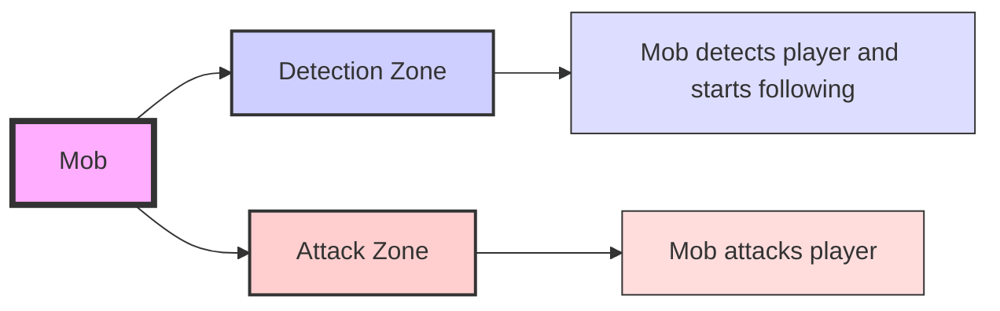

# Mob

See the structure of the [mob](../include/mobs.h#L7) used in the [game](../include/game.h#L34).

Within the game, mobs are entities that can interact with the player and the environment. Each mob has its own set of attributes, behaviors, and states that define how it behaves in the game world.

Each mob use a A* pathfinding algorithm to navigate the game environment. This allows mobs to find the shortest path to their target, whether it's the player or another point of interest in the game world. The A* algorithm takes into account obstacles and terrain to ensure that mobs can move efficiently and realistically.

Each mob have **two circles**.

The first circle is the larger one, which defines the mob's detection zone. When the player enters this zone, the mob becomes aware of the player's presence and may start to follow or attack.

The second circle is smaller and defines the mob's attack zone. When the player enters this zone, the mob can initiate an attack.

